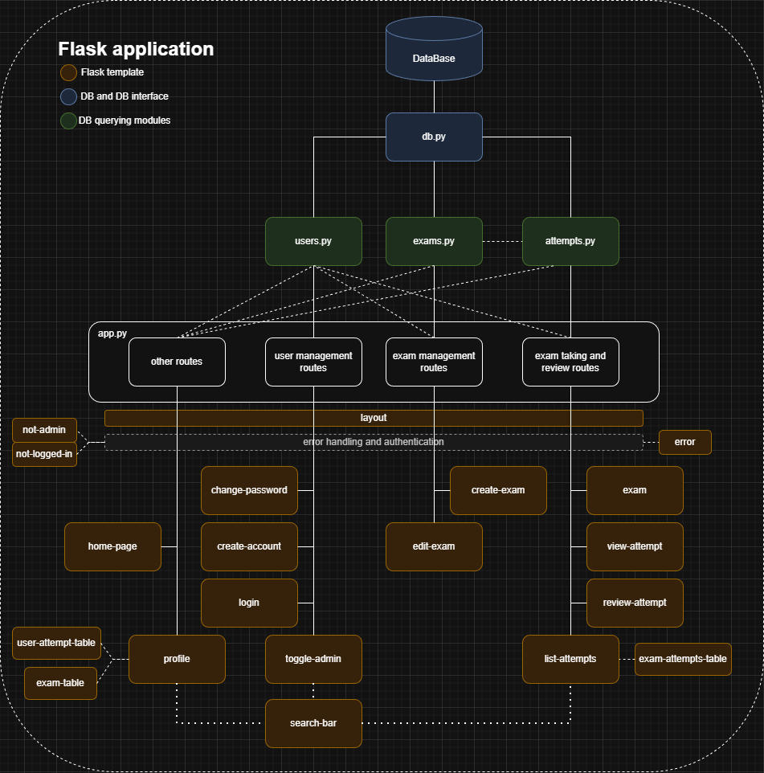

# KoeSovellus 2.0
Tämä on versio 2.0 aloittamastani projektista Helsingin Yliopiston kurssille TiKaWe. Alkuperäinen projekti löytyy haarasta `version1`.

Sovellus on verkkosovellus, jossa voi luoda, suorittaa ja tarkistaa kokeita. Alla on kuvaaja sovelluksen rakenteesta:


## Sovelluksen kokeileminen
Sovellus on kirjoitettu Python 3.11 ja SQlite 3.51. Sinulla tulee olla asennettuna ne. Jotkin muut versiot saattavat toimia myös.
asennus:
- lataa sovellus
- navigoi terminaalissa juuri kansioon
- asenna Flask
```
\> pip install Flask
```
- Alusta tietokanta
```
\> sqlite3 database.db < schema.sql
```
- käynnistä sovellus
```
\> flask run
```
Sovelluksessa on automaattisesti admin käyttäjä, jonka nimi on admin ja salasana on admin. Tämä käyttäjä toimii ainoastaan, jos käytät config.py moduulissa valmista `secret_key` arvoa.

> [!CAUTION]  
> Älä käytä projektin valmista `secret_key` arvoa, jos päädyt käyttämään jotain osaa projektista.

Juuri kansiossa on myös test_data.sql. Testidatan voi lisätä tietokantaan komennolla:
```
\> sqlite3 database.db < test_data.sql
```
